# Configuration

## Installation
After you download the installer (which can be obtained from the [xPilot homepage](https://xpilot.clowd.io/)), double-click the executable to launch the installer. You will be prompted to choose the root folder of your X-Plane installation (this is where the X-Plane.exe lives). You will then be prompted to choose an installation location for the xPilot client. It is recommended that you leave the default location selected as the local application data folder to avoid any file permission problems later.

When the installation is complete, you will have the option of launching xPilot.

!> You must close X-Plane before installing or updating xPilot, otherwise the xPilot plugin cannot be installed or upgraded properly.

Before you can use xPilot, you must install a CSL model set. The most popular option is Bluebell CSL Models, which can be [downloaded from here](https://forums.x-plane.org/index.php?/files/file/37041-bluebell-obj8-csl-packages/). You may optionally choose to use X-CSL models. You will need to use the [CSL2XSB Python script](https://github.com/TwinFan/CSL2XSB) to convert the models so they can be used with xPilot.

## Starting xPilot
To start xPilot, double-click the desktop icon (if you chose to create one during the installation process) or locate xPilot in your programs list.

The first time you run xPilot, you will be prompted to configure xPilot. Click Yes to open the settings window and configure xPilot. See the Configuration section for more details.

After xPilot starts, it will immediately attempt to connect to X-Plane via the configured plugin TCP port. If you change this port number in xPilot, you must also change it within the X-Plane plugin settings. A message will appear in the main message area when a connection is successfully made.

If xPilot cannot establish a connection with X-Plane, make sure your Windows Firewall isn't blocking xPilot or X-Plane. Also check the UDP ports in X-Plane (Settings > Network) and make sure they match these port values:

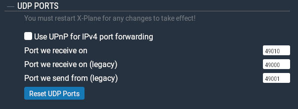

?> If you need to make changes to the X-Plane UDP ports, you must restart X-Plane for them to take effect.

!> Important: You cannot have another multiplayer plugin installed (e.g. XSB, XSwiftBus, etc.). You will need to remove these plugin(s) prior to using xPilot otherwise you may have issues seeing other aircraft or TCAS targets correctly.

## Configuration
To configure xPilot, click the Settings button. You will see the window shown below.

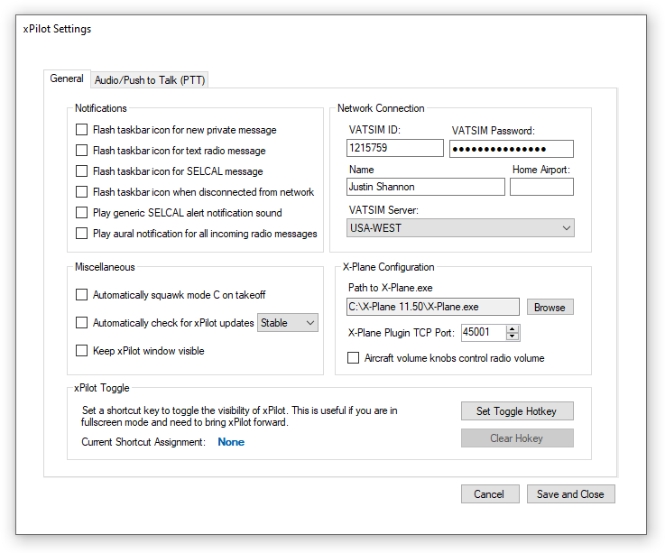

### General
**Network Connection**\
This section is where you enter your VATSIM network credentials, name and home airport. In this section you will also choose which VATSIM server you would like to connect to. Generally, you should choose the server that is geographically closest to you.

**Notifications**\
The options in this section allow you to choose which events will cause the task bar icon to flash when the xPilot when is not active and there is a notification that needs your attention.
* **Play generic SELCAL alert notification** if checked, xPilot will play a generic SELCAL ding as opposed to your actual SELCAL aural tone.
* **Play aural notification for all incoming radio messages** if checked, xPilot will play an alert sound any time a radio text message is received.

**Miscellaneous**\
This section contains a list of miscellaneous configuration options.
* **Automatically squawk Mode C on takeoff** if checked, xPilot will automatically turn your transponder to Mode C after your aircraft leaves the ground.
*  **Automatically check for xPilot updates** if checked, xPilot will automatically check for new versions when launched. It is recommended you leave this option checked. The dropdown box allows you to choose which update channel to use when checking for updates. If you're unsure of which channel, leave it as *Stable*.
* **Keep xPilot window visible** if checked, the xPilot pilot client window will stay on top of all other windows.

**X-Plane Configuration**
* **Path to X-Plane.exe** click the *Browse* button and browse to the path where your X-Plane instance is installed. If you have more than one X-Plane version installed, you will need to update the path and reload xPilot before connecting to the network.
* **X-Plane Plugin Port** xPilot will use this port number to communicate with the X-Plane plugin via TCP socket. The plugin port number **must** match the plugin port defined in the xPilot Preferences in X-Plane. **If you change the port number, you must restart X-Plane and xPilot.**
* **Aircraft volume knobs control radio volume** if this option is checked, you can use the volume knobs in your aircraft to control the COM1 and COM2 volumes (if the aircraft uses the default volume datarefs). If this option is unchecked, you will have to manually adjust the volumes using the volume sliders in the **Audio/Push to Talk (PTT)** tab.

**xPilot Toggle**\
You can set a keyboard shortcut to quickly bring the xPilot client forward. This is useful if you only have one monitor.

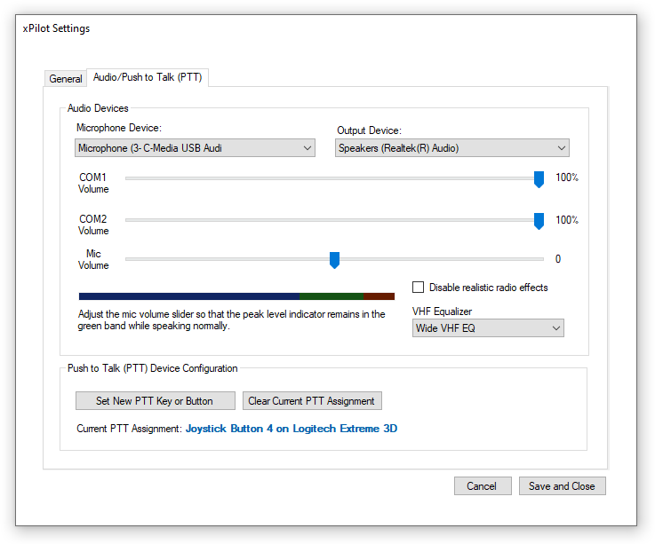

### Audio/Push to Talk (PTT)
This section allows you to choose which audio device to use for your microphone and output audio device. If the device is not yet plugged in, you will need to close the Settings window, plug in the device, and then re-open the Settings window.

!> Once you have your microphone device selected, it's important that you calibrate your microphone. When speaking into your microphone, the calibration bar should be bouncing in the green band. If it does not, increase or decrease the Mic Volume slider until it does.

* **COM1/COM2 Volume**\
These sliders allow you to individually adjust the volumes of COM1 and COM2 radios. Additionally, you can use the volume knobs inside your aircraft to adjust the radio volume. xPilot uses `sim/cockpit2/radios/actuators/aduio_volume_com1` and `sim/cockpit2/radios/actuators/aduio_volume_com2` datarefs, respectively. The volume control uses a logarithmic formula to scale the volume with the dataref value; as a result, the volume sliders will not always match the actual volume knob dataref value in X-Plane.

You may disable the volume knob integration by unchecking the *Aircraft volume knobs control radio volume* in the **X-Plane Configuration** section.

* **Disable realistic radio effects**\
This option will disable all VHF, HF, range degradation, background static, voice equalization and audio filtering. **It is recommended that you leave this option unchecked unless you have difficulties hearing other users.**

* **VHF equalizer**\
This option allows you to change the audio equalizer, which enhances the audio to make it sound more realistic. The "Wide VHF EQ" option is based on Airbus and Boeing Audio Management EQ Response.

* **Push to Talk (PTT) Device Configuration**\
Here you can choose the keyboard key or joystick/yoke button as your preferred PTT (push-to-talk) activation. Click the "Set New PTT Key or Button" button and press the keyboard key or joystick/yoke button you want to use. xPilot will detect the keystroke or button press and update the "Current PTT Assignment" accordingly. In addition, you can also map one or more PTT keys or buttons via the X-Plane command system.

## X-Plane Plugin Menu
There are several xPilot options in the X-Plane plugin menu. To access the plugin menu, find `Plugins > xPilot` as show in the screenshot below. If you have binded a keyboard command to a menu option, the key will show next to the menu item.

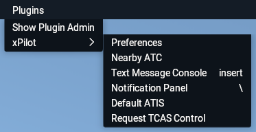

* **Preferences**\
This option opens the xPilot plugin settings window. See the [Plugin Preferences](configuration?id=plugin-preferences) section for more details.

* **Nearby ATC**\
This option toggles the display of the Nearby ATC window. The Nearby ATC window is a list of nearby ATC controllers. Double-click on a controller on the list to automatically tune your COM1 radio to the controller's primary frequency.

* **Text Message Console**\
This option toggles the display of the Text Message Console window. See the [Communicating via Voice](configuration?id=communicating-via-voice) section for more details.

* **Notification Panel**\
This option toggles the display of the semi-translucent notification bar which displays notifications at the top of the X-Plane window in a non-intrusive manner.

* **Enable Default ATIS**\
When checked, the default X-Plane ATIS will play when tuned to an ATIS frequency. It is recommended you leave this option off so the default ATIS doesn't play over a VATSIM ATIS.

* **Disable TCAS**\
If checked, the TCAS integration will be disabled. It is recommended you leave this option enabled if you want TCAS functionality to work.

## Plugin Preferences
There are several options that you will need to configure within X-Plane before you can use xPilot. To access the xPilot settings in X-Plane, open `Plugins > xPilot > Preferences`. You will see the window shown below.

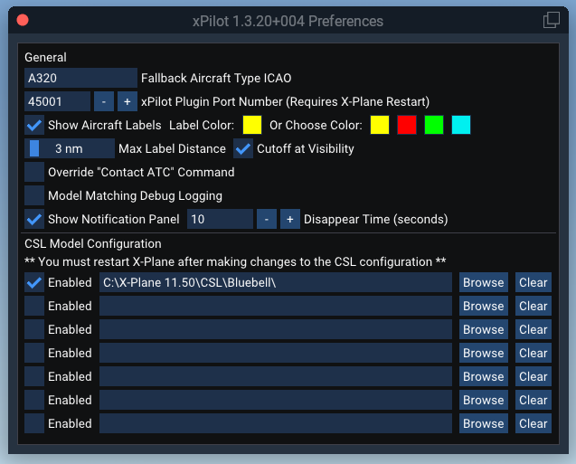

* **Fallback Aircraft Type ICAO**\
If xPilot is unable to find a suitable model for an airplane it encounters from the CSL models you have installed; it will use this aircraft type code to render the airplane.

* **xPilot Plugin Port Number**\
This port number is used for interprocess-communication between the xPilot client and X-Plane. It is recommended you leave this port as the default 45001, but if you do change it, you must also change it in the xPilot client settings. You must restart X-Plane and xPilot if you change the port number. The port number must also be open in your Windows Firewall.

* **Show Aircraft Labels**\
This checkbox allows you to enable or disable aircraft labels within X-Plane. If enabled, a callsign label will be presented above all aircraft in the sim. By default, the label is yellow, but you can customize the label color or choose from the default color options. To use a custom label color, click the box next to the *Label Color* and pick the color.

* **Max Label Distance**\
Use this option to specify how far (in nautical miles) you want to be able to see aircraft labels. The minimum value is 1 and the maximum value is 50.

    * If **Cutoff at Visibility** is checked, aircraft labels will not be shown if the plane is beyond the current visibility range. If this option is unchecked, aircraft labels will show regardless of the visibility conditions (i.e. if the plane is hidden in fog or behind clouds, etc.).

* **Override "Contact ATC" Command**\
If enabled, xPilot will ignore the default "Contact ATC" command. This is useful for PilotEdge users so they do not have to manually un-map this command when using VATSIM.

* **Model Matching Debug Logging**\
Enabling this option will enable verbose logging of CSL model matching in the X-Plane log.txt file.

* **Show Notification Panel**\
The transparent notification panel is enabled by default. When a notification is received, it will be displayed in a semi-transparent black box at the top right of the simulator window. The notification panel can be toggled through the plugin menu or via a keyboard or joystick command (if mapped).

    * The **Disappear Time** allows you to specify how long the notification panel should stay visible after a notification is received. After the specified time elapses, the notification panel will disappear. If the notification panel has been toggled through the plugin menu or via a command, it will remain visible until you toggle it again.

## CSL Model Configuration
xPilot has no complex or special model matching rule sets that need to be installed or configured. You must have at least one CSL model set package installed before you can use xPilot. The most popular model set is [Bluebell CSL](https://forums.x-plane.org/index.php?/files/file/37041-bluebell-obj8-csl-packages/).

You must define the path(s) to where your CSL model sets are installed. You can define up to seven (7) different paths, for example, you could have Bluebell models and X-CSL models.

To define a path to your CSL models, click the Browse button and navigate to the folder where the models are installed. xPilot will search up to 5 hierarchical levels deep for the xsb_aircraft.txt files. CSL paths can be enabled or disabled by using the checkbox next to each path. If the checkbox is checked, the CSL models that live in the path will be automatically loaded during X-Plane startup.

?> Bluebell CSL models are recommended for novice users. You may use X-CSL models, however, you will need to convert them to the standard CSL format using the [CSL2XSB tool](https://github.com/TwinFan/CSL2XSB).

When you load xPilot, it will verify that you have CSL models properly configured. If no models can be found, the path is invalid (no files inside the folder) or the path is not enabled, the Connect button will become disabled and a red error message will be presented:

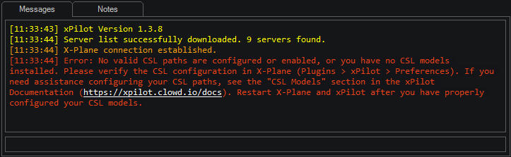

You must restart both X-Plane and xPilot after making changes to the CSL Model configuration for it to take effect.

## X-Plane Command Bindings
xPilot has numerous commands that can be binded to multiple keyboard keys, joystick buttons or switches within x-Plane. If you are not familiar with how to set up command shortcuts in X-Plane, please refer to the [X-Plane 11 manual](https://www.x-plane.com/manuals/desktop/index.html#configuringkeyboardshortcuts) for more information.

* **Radio Push to Talk (PTT)**\
Bind `xpilot/ptt` ("xPilot: Radio Push-To-Talk (PTT)") command to be able to transmit on a radio frequency. If you prefer to bind your PTT within the xPilot client, you may still do so. See the Audio Settings/PTT Settings section for details.

* **Toggle Default X-Plane ATIS**\
Bind `xpilot/toggle_default_atis` ("xPilot: Toggle Default X-Plane ATIS") command to enable or disable the default X-Plane ATIS. xPilt will automatically disable the default ATIS after connecting to VATSIM, but you can enable it again by toggling this command.

* **Toggle Nearby ATC Window**\
Bind `xpilot/toggle_nearby_atc` ("xPilot: Toggle Nearby ATC Window") command to show or hide the Nearby ATC window.

* **Notification Panel**\
Bind `xpilot/toggle_notification_panel` ("xPilot: Notification Panel") command to show or hide the transluscent notification bar at the top of the X-Plane window. If the panel is shown, it will remain visible until it is hidden.

* **Toggle Preferences Window**\
Bind `xpilot/toggle_preferences` ("xPilot: Toggle Preferences Window") command to show or hide the xPilot Preferences window.

* **Toggle Text Message Console**\
Bind `xpilot/toggle_text_message_console`  ("xPilot: Text Message Console") command to show or hide the Text Message Console window.

* **Toggle TCAS Control**\
Bind `xpilot/toggle_tcas` ("xPilot: Toggle TCAS Control") command to request or release TCAS control. *Note: if another plugin already owns the TCAS targets and doesn't release them, xPilot will not have control over them even if requested.*

## Connecting to VATSIM
To connect to VATSIM, click the Connect button. This button is disabled if X-Plane is not running or the CSL model validation failed (see the CSL Models section for details).

After you press the Connect button, you will see the Connect window. You can choose from recently used aircraft or enter new information. The SELCAL code is optional, but the callsign and aircraft type are required.

Press the Connect button when you are ready to connect to the network. If the connection was successful, you will see a message in the main message area and the Connect button will turn blue and will read Disconnect. If there are controllers within range of your location, they will appear in the controller list.

## Disconnecting from VATSIM
To disconnect from VATSIM, click the blue Disconnect button. The controller list will be cleared, and any nearby aircraft will be removed.

Note: xPilot will automatically disconnect from the network if you close X-Plane.

## Controlling the Transponder
While flying on VATSIM, you will need to toggle your transponder between Standby Mode and Mode C. There are two ways to toggle your transponder mode. The first way is through the aircraft itself. The second method is via the main xPilot window.

You may be also asked to "squawk ident" so that the controller can identify you on his radar scope. If you are asked to squawk ident, you can either toggle the ident in the aircraft itself or via the Ident button in the main xPilot window.

?> Some aircraft developers use different datarefs to toggle the aircraft transponder. If you receive complaints that your transponder mode is not functioning properly, please create a thread in the support forums and include details about what happened and what aircraft you're using.

## Communicating via Voice
When you connect to VATSIM, all controllers within range will be displayed in the controller list on the left side of the main xPilot window. Each controller entry will have the controller's callsign and primary frequency. If you hover your mouse over a controller entry, a popup label will appear with the controller's name.

In order to communicate with a controller, your aircraft's master power and avionics power must be on. Then, simply tune the controller's frequency in your aircraft's radio panel using either the COM1 or COM2 radio. The radio must also be selected for transmit and receive. At the top left of the xPilot main window, you will see the TX/RX labels turn white when transmit and receive is enabled for that COM radio.

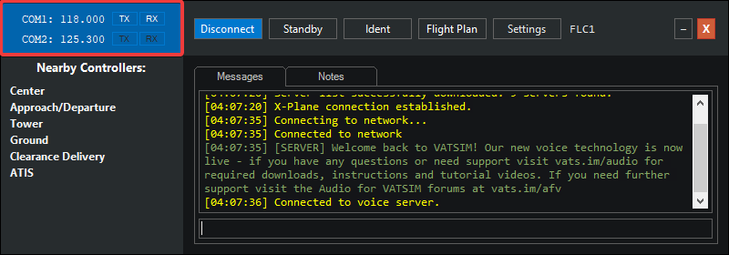

Use the PTT keyboard key and/or joystick button you set earlier to activate the transmit functionality (see the Keyboard Bindings section for more information). When you are finished talking, release the PTT key. When the PTT key is pressed, the "TX" box in the radio panel in the xPilot client will turn green, indicating that you are currently transmitting.

xPilot simulates a 2-COM radio stack which are half-duplex, just as they are in the real world. This means that if you are transmitting, you will not hear any receiving radio audio. However, you will still hear audio received by your secondary radio (if enabled).

?> If your aircraft model does not use the standard com radio datarefs, you can force xPilot to transmit and/or receive on a specific com radio.  
To force xPilot to receive on a specific com radio, use the `.rx` dot command (enter the dot command in the main text command line  
`.rx com# on|off`  Toggles receiving on the specified com radio. For example: `.rx com1 on`  
To force xPilot to transmit on a specific com radio, use the `.tx` dot command (enter the dot command in the main text command line  
`.tx com#`  Enables the COM1 or COM2 radio for transmit. For example: `.tx com2`

## Communicating via Text
To communicate with a controller via text radio message, type your message in text command line in the main message area and press enter. This will send your text message out as a text radio message on whichever COM frequency you have selected for transmit.

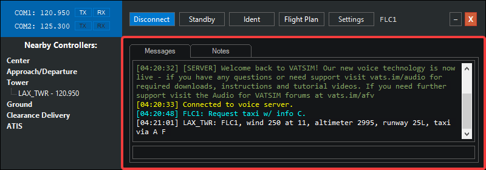

Incoming text radio messages are also shown in the main messages area. If you are listening to more than one COM radio, the text radio messages will include the frequency it arrived on.

If an incoming text radio message is specifically directed to you, you will hear an audible alert sound and the message will appear in white. Text radio messages directed towards others (or as a generic message to everyone) will appear in a gray color.

## Text Message Console
In addition to using the xPilot Client to communicate via text, you can also use the Text Message Console within X-Plane to send and receive radio messages and private messages between other network users. You can open the Text Message Console through the X-Plane menu via `Plugins > xPilot > Text Message Console` or by binding a key or button to toggle the display of the window. See Keyboard Bindings for details.

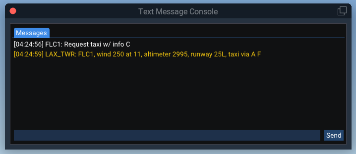

To request a controller's ATIS, send the command `.atis <Callsign>` in the main Messages tab. For example `.atis LAX_TWR`.

To open a new private message tab, use the command `.chat <Callsign> <Message>`. For example `.chat LAX_TWR Do you have a minute for a question?`. Alternatively, you can also open a private message tab without sending an initial message by using just .chat CALLSIGN.

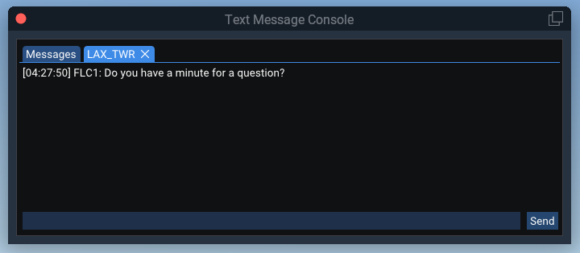

To close a private message tab, click the "X" on the tab, or send the `.close` command in the tab you want to close. You can close multiple private message tabs by sending the command `.closeall` in the Messages tab.

If you open a private message tab through the Text Message Console in X-Plane, the tab will also be opened in the xPilot client (and vice-versa). Closing a private message tab will only close the tab in the location it was closed. For example, if you closed the tab within X-Plane, the tab will still exist in the xPilot client until you close it.

## Notification Panel
All notifications &ndash; radio messages, private message alerts, network broadcast messages, etc. &ndash; will show in a semi-translucent panel at the top right of the screen. The panel will automatically hide after a set time (configurable in the [Plugin Preferences](configuration?id=plugin-preferences)).

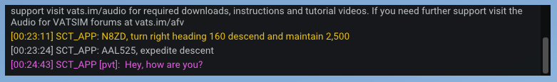

**VR Users:** Due to X-Plane limitations, a VR window cannot be programmatically placed in a specific location. This will cause the notification panel to appear front and center each time it is shown. As a workaround, toggle the notification panel (either through the plugin menu or via a binded command) to force the panel to stay visible and then move the panel somewhere (like the co-pilot's seat).

## SELCAL
If you specified a SELCAL (Selective Calling) code when connecting to VATSIM, controllers will have the ability to send a SELCAL alert to your aircraft using that code. This is used to get your attention during long flights over areas where standard VHF radio doesn't have enough range, and noisy HF frequencies are used instead. The pilot will typically turn down the volume so he doesn't have to listen to the HF static, and controllers will send a SELCAL alert to get his attention when they need to talk to him over HF.

If a SELCAL alert is received, a tone will sound, and a message will be displayed in the main message area alerting you.

## Requesting Controller Information (Text ATIS)
Each controller on VATSIM maintains their controller information (also known as a text ATIS). To request this information, double-click on the controller entry in the controller list. The controller information will appear in the main message area.

## Filing a Flight Plan
To file a flight plan, click the Flight Plan button on the xPilot main window. You will see the window shown below. By default, your previously filed flight plan will populate in the flight plan form. You can fill out the flight plan form when not connected to VATSIM, but you will not be able to file the flight plan until you connect.

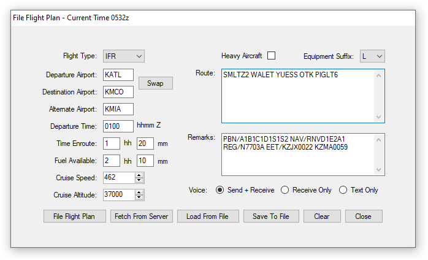

If you check the "Heavy Aircraft" checkbox, xPilot will automatically prefix your aircraft type code with "H/" to indicate to other controllers that you are flying a heavy aircraft.

Choose an equipment suffix from the dropdown so that controllers know what type of navigational equipment your aircraft is equipped with.

Before submitting your flight plan, be sure to choose your voice option. Based on your selection here, xPilot will add the appropriate voice tag to your flight plan remarks so that controllers know what your voice capability is.

If the VATSIM server already has a flight plan on file for your callsign (i.e. if you pre-filed), you can download it by clicking the Fetch From Server button.

## Dot Commands
xPilot supports the following dot commands, which can be entered in the command line just below the main message area (or in any private message tab).

| Command    |             |
| ---------- |-------------|
| `.chat <Callsign> <Message>` | Opens a new chat tab for the specified callsign. You can specify an initial message string to send. If no message string is specified, only a new chat window is opened. You can also use `.msg`
| `.close` | Closes the current chat tab.
| `.atis <Callsign>` | Requests the controller text information/ATIS for the specified callsign.
| `.wx <Station>` | Requests the weather (METAR) for the specified station ID. You can also use `.metar`
| `.wallop <Message>` | Sends a "wallop" to all supervisors connected to the network.
| `.copy` | Copies the contents of the active message tab to your clipboard.
| `.clear`| Clears the contents of the active message tab.
| `.x <Squawk-Code>` | Sets your transponder to the specified squawk code. You can also use `.xpdr`, `.xpndr` or `.squawk`
| `.com1 <Frequency>`| Sets the COM1 radio to the specified frequency.
| `.com2 <Frequency>`| Sets the COM2 radio to the specified frequency.
| `.rx com# <On\|Off>`| Toggles receiving on the specified com radio. For example: `.rx com1 on`
| `.tx com#`| Enables the COM1 or COM2 radio for transmit. For example: `.tx com2`
| `.notes`| Opens a Notes tab if one does not exist. Alternatively, you can close your Notes tab by sending a `.close` command within the Notes tab.
| `.towerview <IP-Address> <Callsign>`| Connects xPilot to a proxy server (such as provided by Euroscope) in observer mode for the purpose of creating a tower view. The IP address defaults to 127.0.0.1 (localhost) and the callsign defaults to TOWER.

## Shared Cockpit/Observer Mode
xPilot supports the ability to connect in observer mode so that your aircraft does not appear to other users on the network. This feature is intended for use with shared cockpit operations. To use this feature, the first pilot should connect to the network normally, and the second pilot should connect in observer mode. The second pilot must use the same callsign as the first pilot, with a letter appended to the end.

For example, if the first pilot's callsign is `JBU123`, the second pilot should use `JBU123A`. Any letter suffix will work.

## Software Updates
Each time you launch xPilot, it will check if there is a newer version available. If there is, you will be prompted to download the update.

If you choose to download the update, xPilot will download the updated installer. When the download is complete, xPilot will close and the installer will open to begin the installation of the new version.

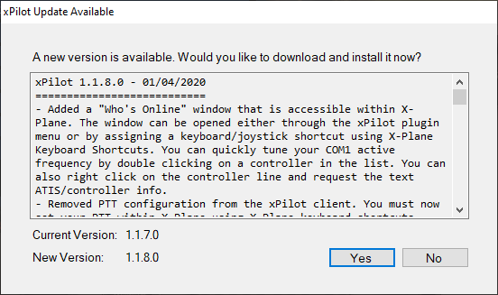