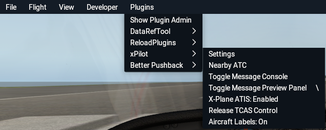
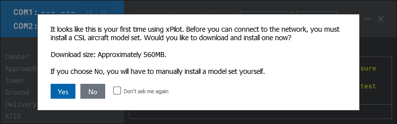
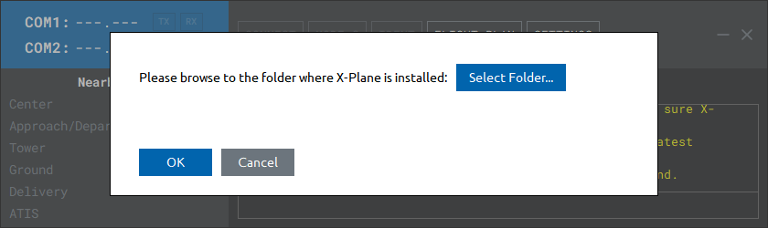

# Installation

!> X-Plane (and xPilot) **must** be closed before installing or upgrading.

Download installation files respective for your computer's operating system from the [xPilot Release Page](https://github.com/xpilot-project/xpilot/releases/latest). The following screenshots are from Windows; however, the installation process will be the same for macOS and Linux.

?> If you're on Windows, you may encounter a Windows Defender SmartScreen speedbump when trying to launch the installer. Simply click the **More info** link then click the **Run anyway** button.

### xPilot Client Install Directory

Choose a folder to install the xPilot client. It is recommended that you leave it as the default folder.

### X-Plane 11 Location

Next, specify the root folder path of where X-Plane 11 is installed to install the xPilot plugin.

!> **Advanced Users:** If you have a multi-computer setup for X-Plane, you will need to run this installer on each computer to install the plugin on that X-Plane instance.

Now launch X-Plane and start a flight. If the xPilot plugin is installed correctly, you will see a new `xPilot` submenu under the X-Plane plugin menu.

## CSL Installation

xPilot has no special or complex model matching rules that need to be configured. Instead, you must have at least one CSL model package installed and xPilot will handle the rest. CSL models are essentially the aircraft models that X-Plane renders as other flying aircraft in your sim. Without these models, xPilot will not be able to render other VATSIM users in the sim.

When you first launch xPilot, you will be prompted to install a CSL model set. It is recommended that you click **Yes** to automatically install and configure the Bluebell CSL model set. If you choose No, you will need to manually install the model set yourself (only recommended for advanced users).

The download is approximately 560 MB. Depending on your internet download speed, it may take a few minutes to download. A progress bar will appear showing the progress of the download.

Once the download is complete, you will be prompted to choose the root folder of where your X-Plane 11 instance is installed.

After you select the path and click **OK**, the models will begin installing. This may take several minutes. Once the process is complete, the model installation window will close and a message will appear in the main window telling you the CSL aircraft model package was successfully installed. **You will need to restart xPilot (and X-Plane if it was already open).**

## Install Additional CSL Packages
Additional CSL model packages can be downloaded and installed to expand your CSL library. To enable additional packages, you will need to specify the paths to where the models are installed in the xPilot settings in X-Plane (`Plugins > xPilot > Settings`). After adding the new folder path, you must restart X-Plane.

