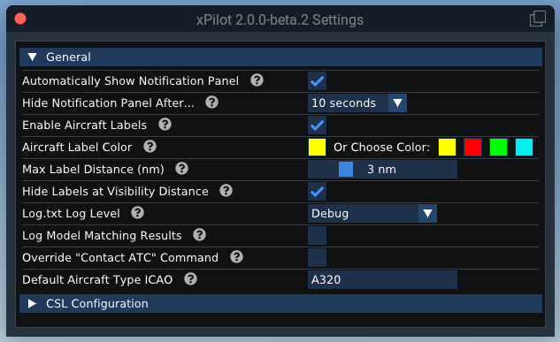
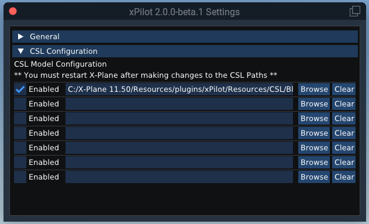
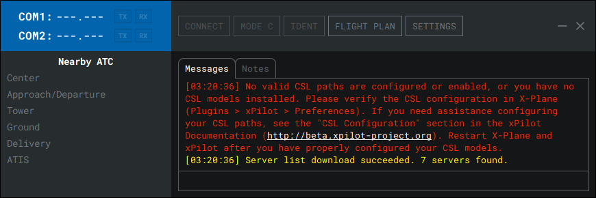
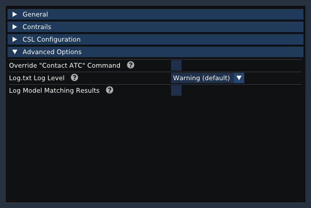
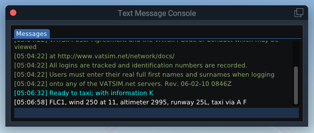
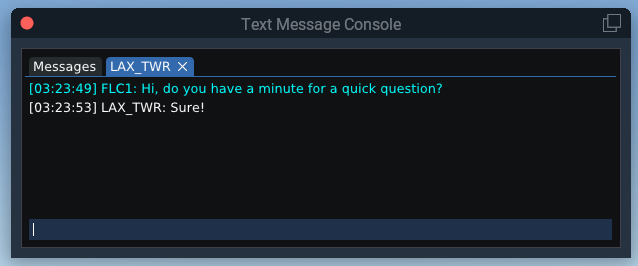
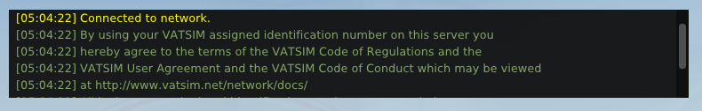
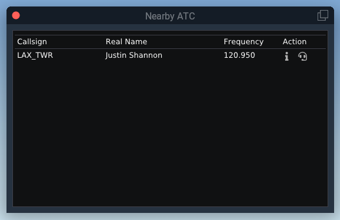

# X-Plane Interface

The xPilot plugin communicates with the xPilot client and interfaces with X-Plane to render aircraft in the sim.

## Settings

The xPilot plugins settings can be accessed through the X-Plane menu: `Plugins > xPilot > Settings`.

All xPilot Plugin settings are saved to a file named `Config.json` in the `X-Plane 11/Resources/plugins/xPilot/Resources` folder.

* **Automatically Show Notification Panel** If this option is enabled, if a new radio text message is received, it will display in a small translucent panel at the top right of the X-Plane window.

* **Hide Notification Panel After...** This option sets how long the notification panel should stay open (in seconds) before it automatically disappears.

* **Show Callsign Labels** If this option is enabled, floating callsign labels will be placed above all aircraft in the sim.

* **Callsign Label Color** You can set a custom or pre-defined aircraft label color (if the callsign labels are enabled). There are four pre-defined colors: yellow, red, green and cyan. You can alternatively pick your own color by clicking the color square to the left of *Or Choose Color*.

* **Max Callsign Label Distance** This option sets how far away you can see aircraft labels (1-nautical miles to 10-nautical miles).

* **Hide Callsign Labels at Visibility Distance** If this option is enabled, aircraft labels will not be sown if the plane is beyond the current visibility range. If left unchecked, aircraft labels will show regardless of the current visibility conditions (i.e., if a plane is hidden in fog or behind clouds, the label will still show).

* **Default Aircraft Type ICAO** The fallback aircraft ICAO type designator that is used if no appropriate CSL model can be found for a plane. The plane will instead be rendered as this aircraft type as opposed to not rendering at all.

## CSL Configuration

xPilot has no complex or special model matching rule sets that need to be installed or configured. You must have at least one CSL model set package installed before you can use xPilot. The most popular model set is Bluebell CSL. When you first install xPilot, you will be prompted to install a CSL model set.

In the xPilot Plugin settings (accessed via `Plugins > xPilot > Settings`), there is a section to define the path(s) to where your CSL model sets are installed. You can define up to seven different paths.

To define a new path, click the `Browse` button and browse to the root folder of your CS models, or manually type in the full path. If there are multiple subfolders, xPilot will search the folders for additional models.

You can disable a path from being loaded when you start X-Plane by unchecking the `Enabled` checkbox.

Each time you load the xPilot client, it will verify that you have CSL models installed and properly configured. If no models are found, or the path is invalid or not enabled, the Connect button will become disabled and a red error message will be presented in the main message area:

If you see this error, make sure you have a CSL model package installed (such as Bluebell CSL Models) and that the path is properly configured in the xPilot plugin settings. Restart xPilot and X-Plane after making the corrective changes.

**Any time you make changes to the CSL configuration you must restart X-Plane for the changes to take effect.**

## Advanced Options

* **Override "Contact ATC" Command** If this option is enabled, xPilot will ignore the "Contact ATC" X-Plane command. This is generally only useful for users who also fly on PilotEdge.

* **Log.txt Log Level** This option limits how much information is written to the X-Plane log.txt file. **Debug** will write the most information, whereas **Fatal** will write the least amount of information. It is recommended that you only change this if you experience odd behavior and need to log additional information for support requests.

* **Log Model Matching Results** If this option is enabled, debug information will be logged to the X-Plane log.txt file about how a CSL model was chosen. You should only enable this option if you need to determine why planes aren't rendering as expected.

## Command Bindings

There are several commands that can be binded to one or more keyboard keys, joystick buttons or switches within X-Plane. If you are not familiar with how to setup command shortcuts in X-Plane, please refer to the [X-Plane 11 Manual](https://www.x-plane.com/manuals/desktop/index.html#configuringkeyboardshortcuts) for more information.

**At minimum, you must configure the Radio Push to Talk (PTT) command binding in order to communicate with controllers via voice on the network.**

**Keyboard PTT Binding: If you set your PTT to a keyboard key, X-Plane must be the only active/focused window for the PTT keypress to be captured (i.e. xPilot cannot be visible on the same screen as X-Plane). If you have a joystick device, it is recommended that you bind your PTT to one of the joystick buttons instead; this will alleviate the issue with X-Plane not properly detecting when your PTT is pressed.**

Available X-Plane Commands:

* **Radio Push to Talk (PTT)** Bind `xPilot: Radio Push-To-Talk (PTT)` command to transmit on a radio frequency while connected to the network.

* **Toggle Default X-Plane ATIS** Bind `xPilot: Toggle Default X-Plane ATIS` command to enable or disable the default X-Plane ATIS. xPilot will automatically disable the default ATIS when connected to the network, but you may enable it again using this command (or via the xPilot plugin menu).

* **Toggle Nearby ATC Window** Bind `xPilot: Toggle Nearby ATC Window` command to show or hide the Nearby ATC window.

* **Toggle Aircraft Labels** Bind `xPilot: Toggle Aircraft Labels` command to show or hide aircraft labels.

* **Toggle Notification Panel** Bind `xPilot: Toggle Notification Panel` command to show or hide the notification panel.

* **Toggle Message Console** Bind `xPilot: Toggle Message Console` command to show or hide the text message console. [See the note](xplane?id=text-message-console) on Keyboard Key Bindings for limitations.

* **Toggle TCAS Control** Bind `xPilot: Toggle TCAS Control` command to request or release TCAS control. If another plugin already owns the TCAS targets and doesn't release them on request, xPilot will not have control.

## Text Message Console

In addition to using the xPilot Client interface to send or receive text radio messages or private messages, you can use the Text Message Console in X-Plane. You can open the Text Message Console through the X-Plane menu via `Plugins > xPilot > Text Message Console` or by binding a keyboard key or joystick button or switch to quickly toggle the visibility of the window. See the [Command Bindings](xplane?id=command-bindings) section for details. 

**Keyboard Key Binding: If you bind a keyboard key to open and close the Text Message Console window, you will not be able to toggle the window closed because the text input box has priority to capture any text that is typed. Instead, you will have to manually close the window. If you bind a joystick button to toggle the window, it should work as expected.**

To send a message, type it in the message composition area at the bottom of the window and press enter on your keyboard. Radio text messages sent in the "Messages" tab are sent out on whichever COM frequency you have selected for transmit. Received radio messages directed towards you appear in white text. All other received messages will be gray. Radio messages sent by you will be cyan colored.

The following dot commands are supported in the Text Message Console in X-Plane:

| Command | Description |
| ---------- |-------------|
| `.chat <Callsign>` | Opens a new chat tab for the specified callsign. You can also use `.msg`
| `.close` | Closes the current private message tab.
| `.closeall` | Closes all private message tabs.
| `.clear`| Clears the contents of the active message tab.
| `.atis <Callsign>` | Requests the controller text information/ATIS for the specified callsign.
| `.wx <Station>` | Requests the weather (METAR) for the specified station ID. You can also use `.metar`
| `.x <Squawk-Code>` | Sets your transponder to the specified squawk code. You can also use `.xpdr`, `.xpndr` or `.squawk`
| `.com1 <Frequency>`| Sets the COM1 radio to the specified frequency.
| `.com2 <Frequency>`| Sets the COM2 radio to the specified frequency.
| `.rx com# On\|Off`| Toggles receiving on the specified com radio. For example: `.rx com1 on`
| `.tx com#`| Enables the COM1 or COM2 radio for transmit. For example: `.tx com2`|

Private messages will appear in a separate tab in the Text Message Console window. To close a tab, click the blue "X". To initiate a new private message, type the command `.chat CALLSIGN` (where CALLSIGN is the callsign of the user you want to send a message to) and press enter. A new tab will open titled with the callsign you specified. Type your message in the message composition area at the bottom of the tab and press enter on your keyboard to send the message.

## Notification Panel
All notifications (text radio messages, private messages, network broadcast alerts, server messages, etc.) will appear in the translucent notification panel at the top right of the X-Plane window. If you hover over the notification panel, a scrollbar will appear allowing you to scroll through the messages. The notification panel will automatically hide after a set time. See the [Settings](xplane?id=settings) section for details on how to configure the timeout period.

**VR Users:** Due to limitations with the X-Plane VR API, a VR window cannot be programmatically placed in a specific location. Because of this, the notification panel will be placed front and center each time it opens. As a workaround, toggle the notification panel (either through the plugin menu or via a binded command) to force the panel to stay open and then move it someplace else (like in the co-pilots seat).

## Nearby ATC

The Nearby ATC window shows controllers who are within range; the list includes the callsign, name and frequency of the station. There are two action buttons available. The first button will request the station information (controller ATIS) and the second button will tune your COM1 radio frequency to the controller's frequency.

